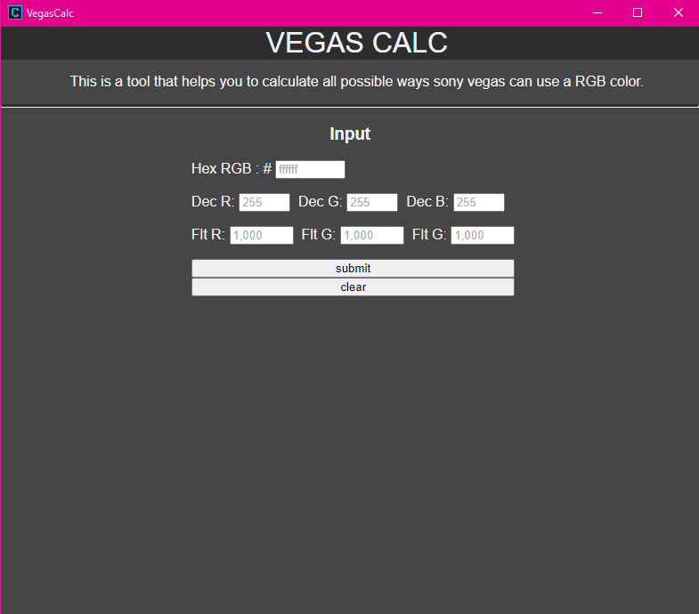
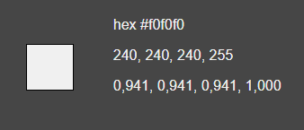

   
# vegasclac
### calculating vegas relavant RGB color value representations

## The Problem
Vegas always used multiple representations for colors so you sometimes have to calculate these values.  
And since **repetitiv math is boring** here is a program for you   

## Screenshot
  
- just enter the value you have
- hit submit and you will see the result
- before entering more values please clear the form with the clear button
  

  
  
If this Program helped you please leave a Star.

**Note:** No affiliation with Vegas Software or Magix Software